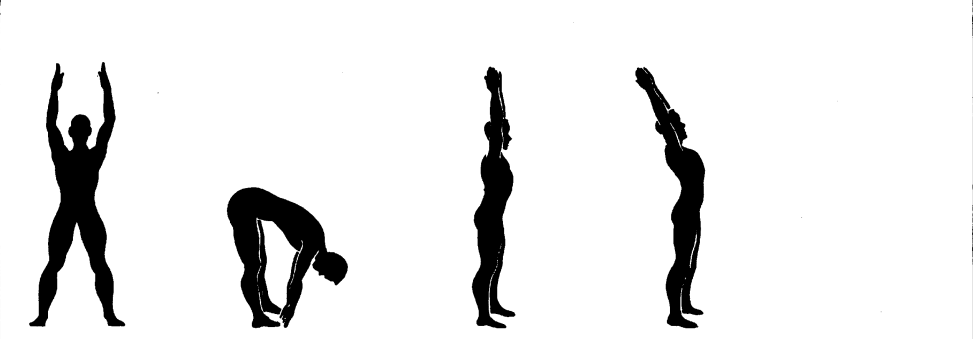
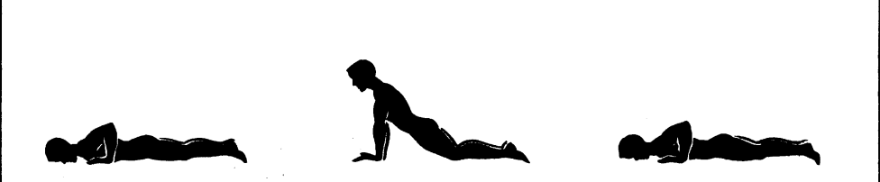
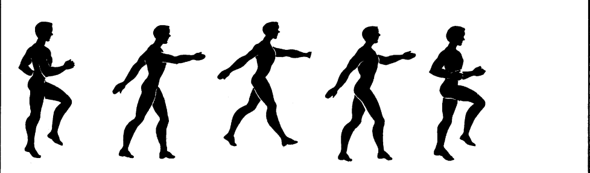

# The Royal Canadian Air Force 5BX Plan

> **Five Basic Exercises. Eleven Minutes a Day. No Equipment Required.**

Welcome to **5BX**, the fitness plan that was decades ahead of its time. 

Developed by Dr. Bill Orban for the Royal Canadian Air Force in the late 1950s, 5BX was the original "HIIT" workout before the term even existed. It was built for pilots stationed in remote frozen outposts with no gyms, no gear, and strictly limited time. 

The promise is simple: **11 minutes a day** to build a body that is ready for anything.

---

## 🚀 The Concept

5BX isn't just a workout; it's a **ladder**. 

You don't just "do exercise." You climb. The system is built on **6 Charts**, comprised of **72 Levels** of increasing difficulty.
*   **The Time**: 11 Minutes. Every single day.
*   **The Mission**: As you get stronger, you don't spend *more* time. You do *more work* in the same time.

### Why It's Legendary
1.  **Zero Friction**: No membership. No clothes to buy. No equipment to set up. You can do it in your pajamas next to your bed.
2.  **Scientifically Balanced**: Dr. Orban carefully sequenced 5 movements to target flexibility, core, back, upper body, and cardio in a precise flow.
3.  **Your Pace**: It meets you exactly where you are. Whether you are a sofa-surfer or a marathon runner, there is a level that will challenge you.

---

## ⚡ The 5 Exercises

11 minutes. 5 movements. Non-stop action.

### 1. Flexibility (2 Minutes)
**Wake up the body.** Loosen the spine, stretch the hamstrings, and get the blood flowing.

### 2. Core (1 Minute)
**Forge the abs.** Sit-ups and leg raises to bulletproof your midsection.

### 3. Back Extension (1 Minute)
**Build the foundation.** Often neglected, a strong lower back is the key to posture and power.

### 4. Upper Body (1 Minute)
**Push power.** From knees to claps, these push-up variations carve your chest and arms.

### 5. Cardio (6 Minutes)
**The engine room.** This is where the magic happens. Stationary running to jack up your heart rate and melt calories.
*   *Prefer the outdoors?* You can swap this for a timed Run or Walk on Charts 1-4.

---

## 📈 Visual Guide: The Charts

The program is built on **6 Charts**. Each chart represents a significant increase in difficulty. Below is **Chart 1**, the launching pad for your journey.

### Chart 1: Beginner Targets
*   **D- to A+**: The 12 steps you must conquer to clear this chart.
*   **Ex 1**: 2 Mins | **Ex 2-4**: 1 Min | **Ex 5**: 6 Mins

| Grade | Ex 1 (Toe Touch) | Ex 2 (Sit Up) | Ex 3 (Bk Ext) | Ex 4 (Push Up) | Ex 5 (Run) |
| :--- | :---: | :---: | :---: | :---: | :---: |
| **A+** | **20** | **18** | **18** | **13** | **400** |
| **A** | **18** | **17** | **17** | **12** | **375** |
| **A-** | **16** | **15** | **16** | **11** | **335** |
| **B+** | **14** | **13** | **15** | **9** | **320** |
| **B** | **12** | **12** | **14** | **8** | **305** |
| **B-** | **10** | **11** | **13** | **7** | **280** |
| **C+** | **8** | **9** | **12** | **6** | **260** |
| **C** | **7** | **8** | **10** | **5** | **235** |
| **C-** | **6** | **7** | **8** | **4** | **205** |
| **D+** | **4** | **5** | **6** | **3** | **175** |
| **D** | **3** | **4** | **5** | **3** | **145** |
| **D-** | **2** | **3** | **4** | **2** | **100** |

> **Your Goal**: Smash Level 12 (A+). Once you do, you graduate to **Chart 2**, where the real work begins.

---

## 🎮 How to Play

### 1. The Daily Grind
Perform the exercises in order. Count your reps. Don't stop.

### 2. Level Up! ⬆️
Did you hit the target numbers for your current level?
*   **YES**: Congratulations! You advance to the next level tomorrow.
*   **NO**: No sweat. Stay at this level and try again. Consistency is key.

### 3. Setbacks & Comebacks 📉
*   **Leapfrog**: Crush the targets? The app might skip you ahead 2 or 3 levels.
*   **3-Strikes**: Miss the target 3 days in a row? The system will automatically lower the difficulty to keep you in the "training zone" rather than the "failure zone."

### 4. Maintenance Mode 🧘
Once you reach the fitness level appropriate for your age, you can switch to **3 days a week**. You have "arrived." (But between us? Go for Chart 6.)

---
 

> *"The 5BX Plan is designed to bring you to a level of physical fitness that will enable you to meet the physical demands of your daily work and play."* 
> 
> — **RCAF Manual (1961)**
